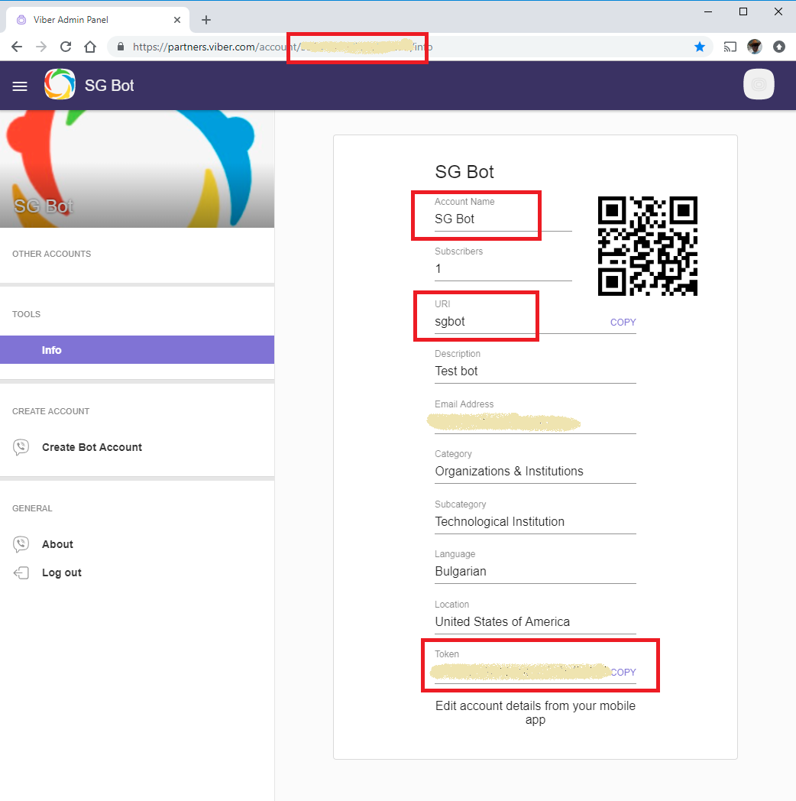

# ut-port-viber

## Properties

Use the screenshots below to define the following properties:

* Bot properties
  * `appId` - use the identifier from the account URL,   highlighted in the screenshot
  * `secret` - use `Token`, highlighted in the screenshot
* Context properties
  * `clientId` - use `URI`, highlighted in the screenshot
  * `accessToken` - use `Token`, highlighted in the screenshot
  * `name` - use `Account Name`, highlighted in the   screenshot

